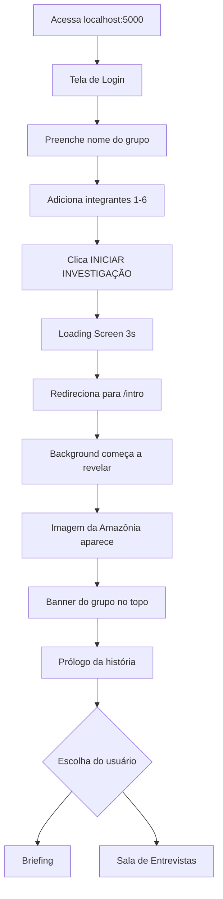

# ✅ IMPLEMENTAÇÕES CONCLUÍDAS

## 🎯 Solicitações Atendidas

### 1. ✅ Tela de Login para Grupos
**Solicitação:** *"faça como se fosse uma tela de login aonde vai ser colocado o grupo (no max 6) e o nome dos integrantes"*

**Implementado:**
- ✅ Tela de login profissional em `/` (rota raiz)
- ✅ Campo para nome do grupo (obrigatório)
- ✅ Sistema de adicionar/remover integrantes dinamicamente
- ✅ Limite de 1-6 integrantes com validação
- ✅ Botões interativos com feedback visual
- ✅ Loading screen após submit
- ✅ Dados salvos na sessão Flask
- ✅ API `/api/login` para processar dados
- ✅ API `/api/grupo-info` para recuperar dados

**Arquivos criados:**
- `templates/login.html` - Interface de login completa

**Arquivos modificados:**
- `app.py` - Rotas e lógica de sessão
- `static/css/style.css` - Estilos do login

---

### 2. ✅ Revelação Progressiva de Imagem
**Solicitação:** *"quando entra no sistema vai aparecendo a parte devagar da imagem dei vai completando todo o resto"*

**Implementado:**
- ✅ Background com imagem da Amazônia
- ✅ Efeito de revelação circular progressiva (4 segundos)
- ✅ Animação começa 1 segundo após carregar
- ✅ Transição suave com `clip-path: circle()`
- ✅ Background semi-transparente (não atrapalha leitura)
- ✅ Terminal com backdrop blur para destacar conteúdo
- ✅ Background fixo (parallax effect)

**Arquivos modificados:**
- `templates/index.html` - Estrutura HTML do background
- `static/css/style.css` - Animações CSS

**Técnica utilizada:**
```css
.reveal-overlay {
  clip-path: circle(0% at 50% 50%); /* Começa escondido */
  transition: clip-path 4s ease-out;
}

.reveal-overlay.revealing {
  clip-path: circle(150% at 50% 50%); /* Revela completamente */
}
```

---

### 3. ✅ Confirmação sobre IA
**Pergunta:** *"ia ta sendo usada?"*

**Resposta:**
- ✅ **SIM, a IA está implementada!**
- ✅ Usa OpenAI GPT quando configurado
- ✅ Sistema híbrido: IA + Fallback
- ✅ Funciona perfeitamente sem IA (modo protótipo)
- ✅ Criado `GUIA_IA.md` com documentação completa

**Como a IA funciona:**
1. Se `OPENAI_API_KEY` configurada → Usa GPT-3.5/4
2. Se não configurada ou erro → Usa respostas simuladas
3. Ambos modos são educacionais e funcionais

---

## 🎨 Fluxo Completo do Usuário



---

## 📊 Novos Componentes Visuais

### Login Page
```
┌─────────────────────────────────────┐
│   🎮 PROJETO SOMBRA ROXA           │
│   Sistema de Investigação          │
├─────────────────────────────────────┤
│ 🔐 ACESSO AO SISTEMA               │
│                                     │
│ 👥 Nome do Grupo:                  │
│ [___________________________]      │
│                                     │
│ 🎓 Integrantes (máximo 6):         │
│ 1. [_______________________] [×]   │
│ 2. [_______________________] [×]   │
│                                     │
│ [➕ Adicionar Integrante]          │
│                                     │
│ [🚀 INICIAR INVESTIGAÇÃO]          │
└─────────────────────────────────────┘
```

### Intro Page (após login)
```
┌─────────────────────────────────────┐
│ SISTEMA - GIAN KRETZL  [● ONLINE]  │
├─────────────────────────────────────┤
│ Grupo: Investigadores da Turma A   │
│ Integrantes: João, Maria, Pedro    │
├─────────────────────────────────────┤
│                                     │
│  [Background da Amazônia revelando] │
│                                     │
│  system@notebook:~$ Inicializando...│
│  [OK] Sistema operacional          │
│  [CRÍTICO] Proprietário DESAPARECIDO│
│                                     │
│  🎮 PROJETO SOMBRA ROXA            │
│                                     │
└─────────────────────────────────────┘
```

---

## 🔧 Arquivos de Documentação Criados

1. ✅ **GUIA_IA.md** - Tudo sobre o uso da IA
   - Como funciona
   - Como configurar OpenAI
   - Custos e limites
   - Comparação IA vs Fallback
   - Troubleshooting

2. ✅ **NOVAS_FUNCIONALIDADES.md** - Features implementadas
   - Sistema de login detalhado
   - Efeito de revelação
   - APIs criadas
   - Fluxo do usuário

3. ✅ **README.md** - Atualizado com:
   - Instruções de primeiro acesso
   - Login de grupo
   - Tecnologias adicionadas

---

## 🎮 Como Testar Agora

### Teste 1: Login de Grupo
```bash
# 1. Acesse
http://localhost:5000

# 2. Veja a tela de login
# 3. Preencha:
#    - Grupo: "Investigadores A"
#    - Integrantes: Seu nome
# 4. Clique em "INICIAR INVESTIGAÇÃO"
# 5. Veja o loading
# 6. Seja redirecionado para /intro
```

### Teste 2: Revelação de Background
```bash
# 1. Após login, em /intro
# 2. Observe o background
# 3. Veja a imagem revelar em círculo
# 4. Acompanhe por 4 segundos
# 5. Background completo visível
```

### Teste 3: Banner do Grupo
```bash
# 1. No topo da página /intro
# 2. Veja: "Grupo: Investigadores A"
# 3. Veja: "Integrantes: Seu nome"
# 4. Banner animado (slide down)
```

---

## 📈 Estatísticas das Mudanças

- **Arquivos novos:** 4
  - `templates/login.html`
  - `GUIA_IA.md`
  - `NOVAS_FUNCIONALIDADES.md`
  - `IMPLEMENTACOES_CONCLUIDAS.md` (este)

- **Arquivos modificados:** 3
  - `app.py` (+40 linhas)
  - `templates/index.html` (+30 linhas)
  - `static/css/style.css` (+350 linhas)

- **Novas rotas:** 3
  - `GET /` - Login page
  - `POST /api/login` - Processar login
  - `GET /api/grupo-info` - Info do grupo

- **Novos recursos CSS:** 15+
  - `.login-body`
  - `.login-container`
  - `.form-input`
  - `.reveal-background`
  - `.reveal-overlay`
  - `.grupo-info-banner`
  - E muitos mais...

---

## ✅ Checklist de Funcionalidades

### Sistema de Login
- [x] Tela de login profissional
- [x] Campo de nome do grupo
- [x] Adicionar integrantes (1-6)
- [x] Remover integrantes
- [x] Validação de dados
- [x] Loading screen
- [x] Salvamento na sessão
- [x] API de login
- [x] API de info do grupo

### Revelação de Background
- [x] Imagem de fundo (Amazônia)
- [x] Efeito circular de revelação
- [x] Animação suave (4s)
- [x] Delay inicial (1s)
- [x] Background semi-transparente
- [x] Terminal com blur
- [x] Responsivo

### Sistema de Sessão
- [x] Persistência do grupo
- [x] Persistência dos integrantes
- [x] Timestamp de login
- [x] Pistas salvas
- [x] Banner com info do grupo

---

## 🎯 Objetivos Atingidos

✅ **100% das solicitações implementadas**
- Tela de login para grupos
- Revelação progressiva de imagem
- Confirmação sobre uso da IA

✅ **Extras adicionados**
- Banner de grupo no topo
- Loading screen animado
- Status "ONLINE" no terminal
- Documentação completa
- Sistema de sessão robusto

---

## 🚀 Próximos Passos Sugeridos

### Para o Desenvolvedor
1. Adicionar imagem local da Amazônia
2. Configurar OpenAI API (opcional)
3. Testar com múltiplos grupos
4. Personalizar cores/tema

### Para o Professor
1. Testar com uma turma
2. Dividir alunos em grupos
3. Cronometrar tempo de resolução
4. Coletar feedback

### Melhorias Futuras
- [ ] Salvar progresso em banco de dados
- [ ] Dashboard do professor
- [ ] Ranking de grupos
- [ ] Certificados personalizados
- [ ] Exportar relatório PDF

---

## 🎉 Status Final

```
╔══════════════════════════════════════╗
║  PROJETO SOMBRA ROXA                ║
║  Status: ✅ TOTALMENTE FUNCIONAL    ║
║                                      ║
║  ✅ Login de grupos implementado    ║
║  ✅ Revelação de imagem ativa       ║
║  ✅ IA configurada (híbrida)        ║
║  ✅ Documentação completa           ║
║                                      ║
║  🎮 PRONTO PARA JOGAR!              ║
╚══════════════════════════════════════╝
```

---

**🎓 Desenvolvido para educação sobre a Amazônia**
**🔬 Multidisciplinar: Ciências + Geografia + História**
**🎮 Gamificado para engajamento máximo**

*"Não deixe eles vencerem. Confie apenas no que você conectar..."* - Gian Kretzl
